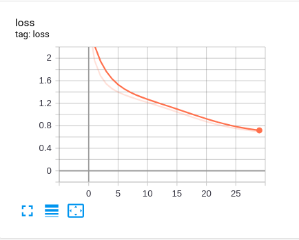

# GRU-Text-Generation
Try to GRU model to  complete text generation task

## Data
### shakespeare
<https://storage.googleapis.com/download.tensorflow.org/data/shakespeare.txt>


## Train Logs
### scratch 

      |
:-------------------------:|
Displayed Loss on Tensorboard |  

```shell script
Epoch 1 Step 99 Loss 2.3351454734802246
Epoch 1 train Loss 2.6764590740203857
Time taken for epoch 10.17563247680664 sec

Epoch 2 Step 99 Loss 1.9347928762435913
Epoch 2 train Loss 1.9615672826766968
Time taken for epoch 8.520015716552734 sec

Epoch 3 Step 99 Loss 1.6661138534545898
Epoch 3 train Loss 1.6932737827301025
Time taken for epoch 8.767622709274292 sec

Epoch 4 Step 99 Loss 1.6037914752960205
Epoch 4 train Loss 1.5449694395065308
Time taken for epoch 8.758196592330933 sec

Epoch 5 Step 99 Loss 1.4619581699371338
Epoch 5 train Loss 1.4575934410095215
Time taken for epoch 9.205365896224976 sec

Epoch 6 Step 99 Loss 1.3809807300567627
Epoch 6 train Loss 1.3974902629852295
Time taken for epoch 8.62232494354248 sec

Epoch 7 Step 99 Loss 1.3954782485961914
Epoch 7 train Loss 1.3518081903457642
Time taken for epoch 8.893566846847534 sec

Epoch 8 Step 99 Loss 1.31563401222229
Epoch 8 train Loss 1.3130409717559814
Time taken for epoch 8.73643684387207 sec

Epoch 9 Step 99 Loss 1.2698291540145874
Epoch 9 train Loss 1.2780852317810059
Time taken for epoch 8.995293140411377 sec

Epoch 10 Step 99 Loss 1.2700861692428589
Epoch 10 train Loss 1.2439918518066406
Time taken for epoch 8.677635431289673 sec

Epoch 11 Step 99 Loss 1.2333570718765259
Epoch 11 train Loss 1.2111027240753174
Time taken for epoch 8.522033929824829 sec

Epoch 12 Step 99 Loss 1.214597463607788
Epoch 12 train Loss 1.1785026788711548
Time taken for epoch 9.052775382995605 sec

Epoch 13 Step 99 Loss 1.172529697418213
Epoch 13 train Loss 1.1445205211639404
Time taken for epoch 8.91270899772644 sec

Epoch 14 Step 99 Loss 1.1069660186767578
Epoch 14 train Loss 1.1109652519226074
Time taken for epoch 9.157858848571777 sec

Epoch 15 Step 99 Loss 1.0728667974472046
Epoch 15 train Loss 1.0757746696472168
Time taken for epoch 9.053652048110962 sec

Epoch 16 Step 99 Loss 1.0536006689071655
Epoch 16 train Loss 1.0398986339569092
Time taken for epoch 8.297941446304321 sec

Epoch 17 Step 99 Loss 1.0076903104782104
Epoch 17 train Loss 1.0027961730957031
Time taken for epoch 8.275501251220703 sec

Epoch 18 Step 99 Loss 0.9893338680267334
Epoch 18 train Loss 0.9664105176925659
Time taken for epoch 8.685819387435913 sec

Epoch 19 Step 99 Loss 0.91045081615448
Epoch 19 train Loss 0.9310917258262634
Time taken for epoch 8.916808843612671 sec

Epoch 20 Step 99 Loss 0.9089723825454712
Epoch 20 train Loss 0.8977298736572266
Time taken for epoch 8.625535488128662 sec

Epoch 21 Step 99 Loss 0.8815729022026062
Epoch 21 train Loss 0.8669900298118591
Time taken for epoch 8.786775588989258 sec

Epoch 22 Step 99 Loss 0.8426538109779358
Epoch 22 train Loss 0.8371233940124512
Time taken for epoch 8.806946039199829 sec

Epoch 23 Step 99 Loss 0.8312783241271973
Epoch 23 train Loss 0.8098650574684143
Time taken for epoch 8.903682231903076 sec

Epoch 24 Step 99 Loss 0.7799287438392639
Epoch 24 train Loss 0.7852213978767395
Time taken for epoch 8.968154907226562 sec

Epoch 25 Step 99 Loss 0.789299726486206
Epoch 25 train Loss 0.7655978202819824
Time taken for epoch 8.81480073928833 sec

Epoch 26 Step 99 Loss 0.7435064315795898
Epoch 26 train Loss 0.7474843859672546
Time taken for epoch 8.572936773300171 sec

Epoch 27 Step 99 Loss 0.724311113357544
Epoch 27 train Loss 0.7296299934387207
Time taken for epoch 8.881128311157227 sec

Epoch 28 Step 99 Loss 0.7229156494140625
Epoch 28 train Loss 0.7183087468147278
Time taken for epoch 8.867656230926514 sec

Epoch 29 Step 99 Loss 0.7182175517082214
Epoch 29 train Loss 0.7055217027664185
Time taken for epoch 8.83176040649414 sec
```

## TODO
